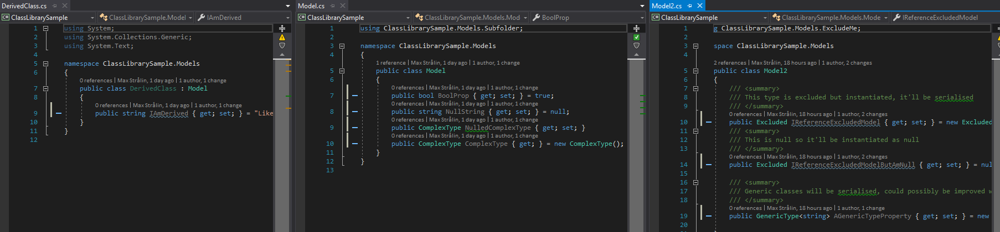
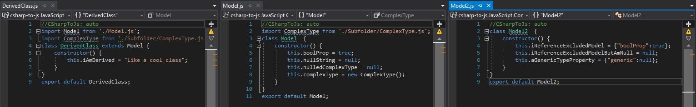

# C# to JS
> Used for converting C# models and DTOs to javascript classes

A global .NET Core tool to easily convert C# models and classes into Javascript classes

##### Why does this even exist?
Very existential question. Short story: I found that I had viewmodels for the backend, e.g. `NewUser.cs`, and a form in the frontend, e.g. in Vue.js, which used a `NewUser.js` viewmodel.
So, I usually found that I wanted to mirror my C# VM to an eq equivalent Javascript VM for the frontend. More than once I ended up with "property undefined" since I had forgotten to update my `NewUser.js` when I added a new property to the viewmodel.

This was born out of the desire to mirror my C# models in my frontend applications without manual code duplication.

See [Examples](#examples) for some additional info.

**C# Input**

**JS output**


## Installation
#### Install the tool
```sh
dotnet tool install --global CSharpToJs
```
#### Update .csproj

Update your project to output all its dependencies by adding `<CopyLocalLockFileAssemblies>true</CopyLocalLockFileAssemblies>` to your `.csproj` file for the project you're running the tool for. This is so the CSharpToJs tool can resolve any dependencies used, e.g. Nuget packages.
```
<PropertyGroup>
    <OutputType>Exe</OutputType>
    <TargetFramework>netcoreapp2.2</TargetFramework>
    <CopyLocalLockFileAssemblies>true</CopyLocalLockFileAssemblies>
</PropertyGroup>
```

#### Create a configuration file

Add a `csharptojs.config.json`. I'd recommend the project's root folder but you can place it wherever you want. By default, the tool will look in the folder in which you're executing the tool in but also accepts a path (excl. filename) to the config file.

**Note that any relative paths in the config will be relative to where the tool is being executed, not where the config file is.**

See [Usage](#configuration-file) for details.


## Usage

#### Simple

Simply execute `csharptojs` in the command line without any arguments. The `csharptojson.config.json` will be read from the folder where the tool is being executed. 
```sh
$ csharptojs
```

#### With path to config

The first, and only, argument is the path to the config file, without the filename.
E.g. `c:/config/a-folder/csharptojson.config.json` would be:
```sh
$ csharptojs c:/config/a-folder
```

### Configuration file
A JSON file with the options. See [example in Samples](https://github.com/maxstralin/csharp-to-js/blob/master/samples/ConsoleAppSample/csharptojs.config.json) or [C# definition file](https://github.com/maxstralin/csharp-to-js/blob/master/src/Core/Models/CSharpToJsConfig.cs).
```js
{
   /**
     * Relative path to the binaries, e.g. bin/Debug/netstandard2.0
     * @type String
     */
   "assembliesPath": null, 
   /**
     * Details of the assemblies to convert in
     * @type AssemblyDetails[]
     */
   "assemblyDetails": [], 
   /**
     * The relative path to the execution path which the JS files will be outputted
     * @type string
     */
    "outputPath": null, 
   /**
     * Default false. If true, the output path won't be deleted before output
     * @type Boolean
     */
    "noClean": false, 
   /**
     * Experimental and not recommended at the moment. If true, uses the default Nuget package location to find assembly dependencies
     * @type Boolean
     */
    "useNugetCacheResolver": false,
    
}
```
Assembly details
```js
{
    /**
     * Filename of the assembly, without .dll
     * @type string
     */
    "name": null,
    /**
     * Subfolder to output this assembly's JS files to
     * @type string
     */
    "subFolder": null,
    /**
     * Namespaces to include. Will include everything nested, e.g. "Namespace.A" will include C# classes in "Namespace.A", "Namespace.A.B" and "Namespace.A.B.C"
     * @type String[]
     */
    "include": [],
    /**
     * Namespaces to exclude. Takes precedence over Include. Will exclude everything nested, see details of Include.
     * @type String[]
     */
    "exclude": [],
}
```

## Examples
A simple example using Vue.js

C# model
```csharp
public class NewUserVm {
    public string Email { get; set; }
    public string Name { get; set; } = "Cool guy";
}
```
Ouputted JS
```js
class NewUserVm {
    constructor() {
        this.email = null;
        this.name = "Cool guy";
    }
}
export default NewUserVm;
```

Vue file
```html
<template>
    <div>Email: <input type="text" v-model="vm.email"></div> <!-- Empty -->
    <div>Name: <input type="text" v-model="vm.name"></div> <!-- "Cool guy" -->
</template>
<script>
    import vm from '../../models/ViewModels/NewUserVm';

    export default {
        data() {
            return {
                user: new vm()
            }
        }
</script>
```

## Release History
* 1.0.0-rc1
    * First release candidate

## Contributing

Contributions are what make the open source community such an amazing place to be learn, inspire, and create. Any contributions you make are greatly appreciated.

1. Fork the Project
2. Create your Feature Branch (`git checkout -b feature/AmazingFeature`)
3. Commit your Changes (`git commit -m 'Add some AmazingFeature'`)
4. Push to the Branch (`git push origin feature/AmazingFeature`)
5. Open a Pull Request